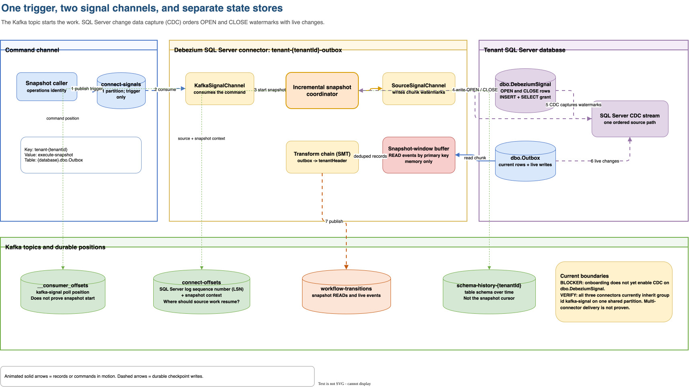
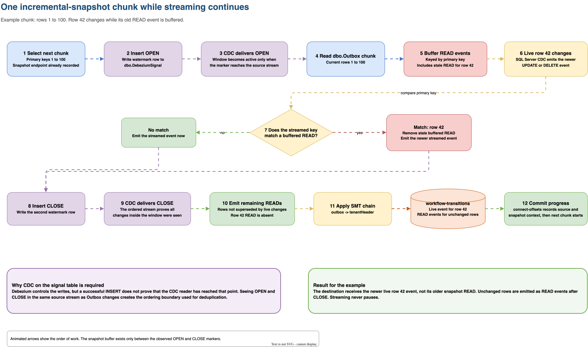
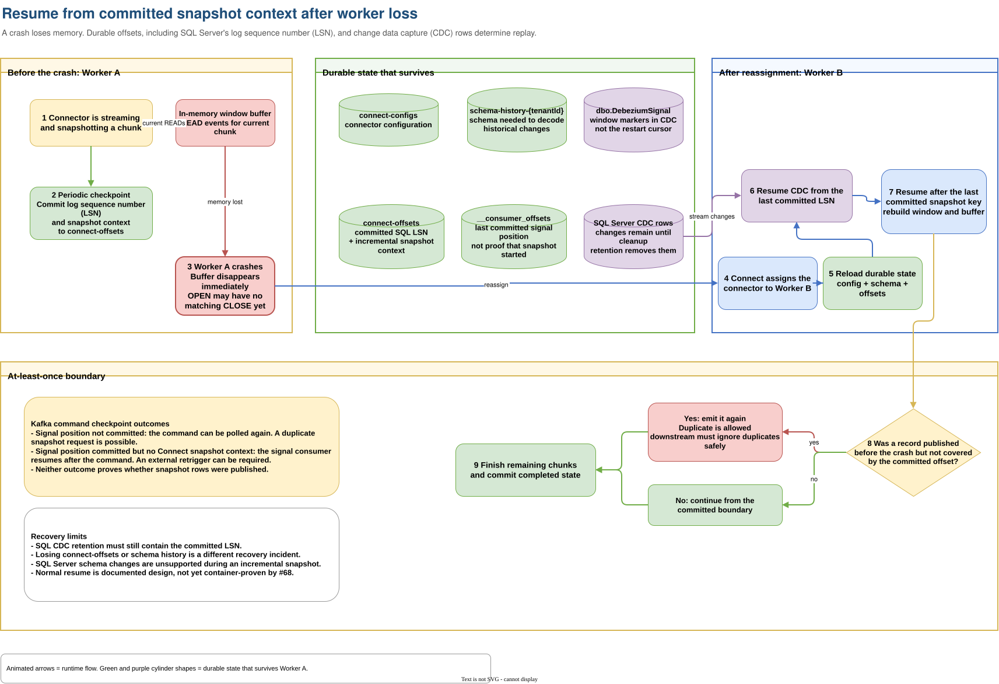

# Incremental snapshot container test

This test proves that a running SQL Server connector re-reads an existing
`dbo.Outbox` row after a request arrives on `connect-signals`. The second event
must retain the original key, payload, header names, and header bytes because
snapshot records pass through the same configured transform chain as live
change records.

The test observes the live change before it sends the request. It also checks
that no duplicate is already waiting. This order prevents the original change
event from being mistaken for the snapshot result.

The Kafka topic carries only the request. The connector writes open and close
rows to `dbo.DebeziumSignal` to watermark each snapshot chunk and deduplicate
snapshot rows that overlap with live changes. The [V3 verification
result](https://github.com/collaborationwithothers/cdc-platform-azure/issues/63#issuecomment-5386222915)
records this split between the Kafka and database signaling channels.

## Visual walkthrough

The channels diagram separates the trigger, watermark stream, output topic,
and durable offset stores.



The window diagram follows one chunk while row 42 changes during the open
snapshot window.



The recovery diagram shows which state survives a worker crash and why replay
can produce duplicates.



From the repository root, run the test with Docker available:

```bash
dotnet test tests/Lexfield.Connect.Tests/Lexfield.Connect.Tests.csproj
```

The test uses the connector image and connector configuration that the
repository ships. SQL authentication and disabled driver encryption are the
only database connection changes required by the local SQL Server container.
